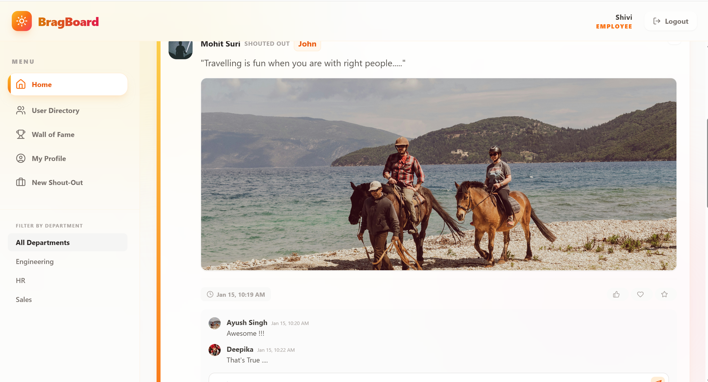
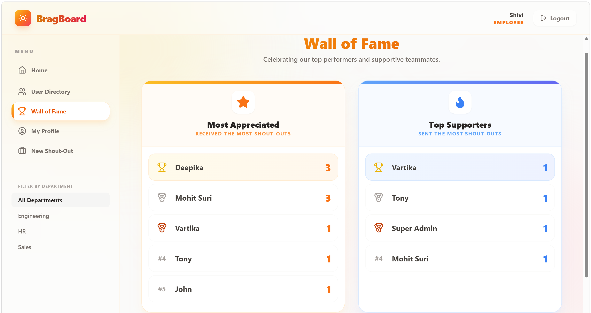

# 🏆 BragBoard: Employee Appreciation Platform

> A modern, gamified peer-to-peer recognition platform designed to boost team morale, foster workplace culture, and track employee engagement through interactive shout-outs and leaderboards.

---

## 📖 Overview

In many organizations, peer appreciation is lost in siloed emails or physical bulletin boards. **BragBoard** digitizes and gamifies this experience. It acts as an internal social network where employees can publicly acknowledge their colleagues' achievements, interact through comments and reactions, and climb a public leaderboard. 

Designed with a focus on robust backend architecture and a responsive glassmorphism UI, this platform includes full role-based access control (RBAC), allowing administrators to moderate content and export analytics.

## ✨ Key Features

### 🤝 Social Engagement
* **Dynamic Feed:** A central timeline displaying appreciation posts (Shout-outs) across departments.
* **Rich Interactions:** Users can attach images to posts, tag multiple colleagues, and interact via nested comments and a toggleable reaction system (Like, Heart, Star).
* **Personalized Profiles:** Secure user authentication (JWT) with customizable avatars and department tagging.

### 🎮 Gamification & Analytics
* **The Wall of Fame:** An automated, real-time leaderboard ranking the "Top Contributors" (most shout-outs sent) and "Most Appreciated" (most tagged) employees.
* **Data Portability:** One-click CSV generation for HR teams to export user engagement metrics, reports, and platform activity directly from the server memory.

### 🛡️ Administration & Moderation
* **Role-Based Access Control:** Strict separation between `employee` and `admin` API routes.
* **Content Moderation:** Community-driven reporting system allowing users to flag inappropriate content.
* **Admin Dashboard:** A dedicated portal for administrators to review flagged posts, resolve tickets, and enforce community standards by deleting content.

---

## 💻 Tech Stack

### Frontend
* **Framework:** React.js
* **Styling:** Tailwind CSS (Glassmorphism design language)
* **Integration:** Asynchronous Fetch API for RESTful communication

### Backend
* **Framework:** FastAPI (Python)
* **Security:** Argon2 Password Hashing, JWT (JSON Web Tokens) for stateless session management, CORS configuration
* **ORM & Database:** SQLAlchemy interfacing with a **PostgreSQL** relational database.

---

## 📸 Platform Previews

*(Note to visitor: Since the live preview is currently offline, here are screenshots of the local build.)*

### 1. The Main Feed & Shout-outs

*Employees can scroll through recent shout-outs, view attached media, and engage with comments and reactions.*

### 2. Gamified Leaderboard

*The Wall of Fame dynamically calculates the top interactors on the platform to encourage participation.*

### 3. Admin Moderation Dashboard

*Secure administrative view for resolving user reports and exporting platform data to CSV.*

---

## ⚙️ Local Setup & Installation

If you would like to run this project locally, follow these steps:

### Prerequisites
* Node.js & npm
* Python 3.9+
* PostgreSQL server running locally

### Backend Setup
1. Navigate to the backend directory:
    bash** cd backend **

2. Create and activate a virtual environment:
    bash** python -m venv venv source venv/bin/activate  # On Windows use: venv\Scripts\activate **

3. Install dependencies:
    bash** pip install -r requirements.txt **

4. Configure your .env file with your PostgreSQL database credentials.

5. Start the FastAPI server:
    bash** uvicorn main:app --reload **

### Frontend Setup
1. Navigate to the frontend directory:
    bash** cd frontend **

2. Install dependencies:
    bash** npm install **

3. Start the development server:
    bash** npm run dev **

4. Open **http://localhost:5173** in your browser.

### 👨‍💻 Author
Grassim Jaiswal

Python Full-Stack Developer

LinkedIn Profile **https://linkedin.com/in/gr-grassim/**

GitHub Profile **https://github.com/gr-grassim/**